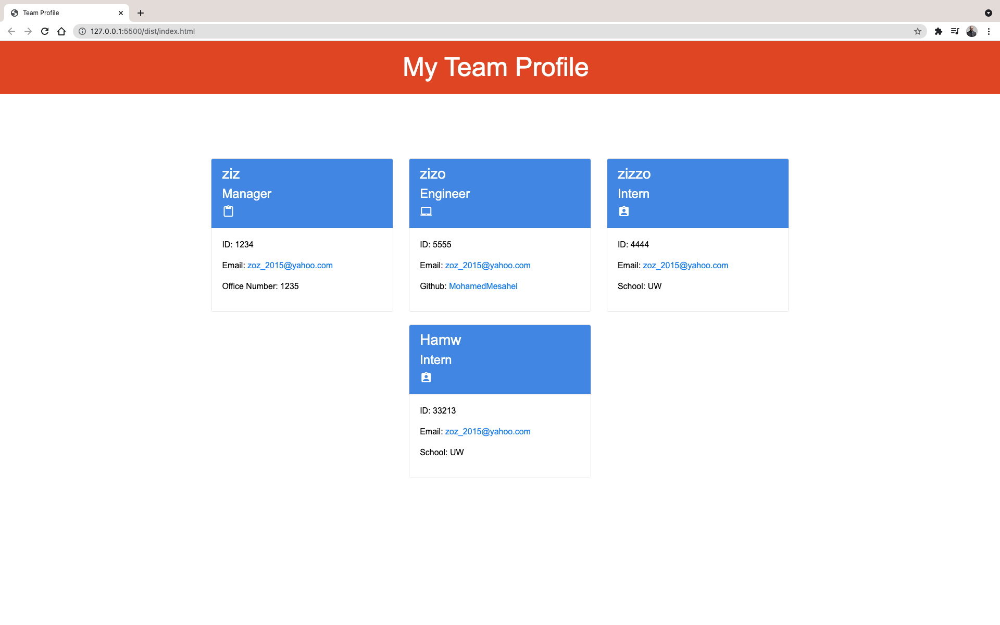

<div id="top"></div>

<!-- Badges -->
[](http://shields.io/)
[](http://shields.io/)
[](http://shields.io/)
[](http://shields.io/)
[](http://shields.io/)
[](http://shields.io/)

# Team-Profile-Generator
This application was created to build a Node.js command-line application that takes in information about employees on a software engineering team, then generates an HTML webpage that displays summaries for each person.

## Table of Contents
<!-- TABLE OF CONTENTS -->
<details>
  <summary><strong>Table of Contents</strong></summary>
  <ol>
    <li>
      <a href="#about-the-project">About The Project</a>
      <ul>
        <li><a href="#built-with">Built With</a></li>
      </ul>
    </li>
    <li><a href="#user-story">User Story</a></li>
    <li><a href="#link-to-live-demo">Link to Live Demo</a></li>
    <li><a href="#usage">Usage</a></li>
    <li><a href="#prerequisites">Prerequisites</a></li>
    <li><a href="#installation">Installation</a></li>
    <li><a href="#contributing">Contributing</a></li>
    <li><a href="#license">License</a></li>
    <li><a href="#contact">Contact</a></li>
    <li><a href="#acknowledgments">Acknowledgments</a></li>
  </ol>
</details>

## About The Project


Testing is key to making code maintainable, so I also wrote a unit test for every part of youthe application and ensured that it passes each test.

## User Story

```md
AS A manager
I WANT to generate a webpage that displays my team's basic info
SO THAT I have quick access to their emails and GitHub profiles
```

### Link to Live Demo
- [Screencastify](https://drive.google.com/file/d/1ME6q9pFHJHn1M5F0CB7Zh9czBusj0NOm/view)

### Prerequisites

Please make sure that you have the latest node packages.
* npm
  ```sh
  npm install npm@latest -g
  ```
## Installation 
- Download it through Github
- Run npm i or (npm install), to make sure to download the jason package and inquirer.
- Also this app using "jest" module for testing.
- The application uses [Jest](https://www.npmjs.com/package/jest) for running the unit tests and [Inquirer](https://www.npmjs.com/package/inquirer) for collecting input from the user. 
- The application will be invoked by using the following command:

```bash
node index.js
```

It is recommended that you start with a directory structure that looks like the following example:

```md
__tests__/			// jest tests
  Employee.test.js
  Engineer.test.js
  Intern.test.js
  Manager.test.js
dist/               // rendered output (HTML) and CSS style sheet
lib/				// classes
src/				// template helper code
index.js			// runs the application
```

## Usage 
After installation run command `node index.js` in the command line and the app will start  asking you series of questions to build your HTML file, after answering all the questions your HTML.file will be generated with your team card information.
- Run `npm test` to run Jest for tests on constructors. 


### Built With

JavaScript, NodeJS,Inquirer and Jest.
<p align="right">(<a href="#top">back to top</a>)</p>

## Contributing

Contributions are what make the open source community such an amazing place to learn, inspire, and create. Any contributions you make are **greatly appreciated**.

If you have a suggestion that would make this better, please fork the repo and create a pull request. You can also simply open an issue with the tag "enhancement".
Don't forget to give the project a star! Thanks again!

1. Fork the Project
2. Create your Feature Branch (`git checkout -b feature/AmazingFeature`)
3. Commit your Changes (`git commit -m 'Add some AmazingFeature'`)
4. Push to the Branch (`git push origin feature/AmazingFeature`)
5. Open a Pull Request


<!-- CONTACT -->
## Contact
[](http://shields.io/)

Mohamed Mesahel - mohamed.mesahel86@gmail.com

[](http://shields.io/)

https://github.com/MohamedMesahel

[![LinkedIn][linkedin-shield]][linkedin-url] 

<!-- LICENSE -->
## License

Distributed under the MIT License. 
<!-- ACKNOWLEDGMENTS -->
## Acknowledgments

List for some useful resources!
* [Inquirer](https://www.npmjs.com/package/inquirer)
* [Jest](https://www.npmjs.com/package/jest)
* [Inquirer](https://www.npmjs.com/package/inquirer)


<p align="right">(<a href="#top">back to top</a>)</p>

<!-- MARKDOWN LINKS & IMAGES -->
<!-- https://www.markdownguide.org/basic-syntax/#reference-style-links -->
[linkedin-shield]: https://img.shields.io/badge/LinkedIn-0077B5?style=for-the-badge&logo=linkedin&logoColor=white
[linkedin-url]: https://www.linkedin.com/in/mohamed-mesahel-pmp-570a0423/


